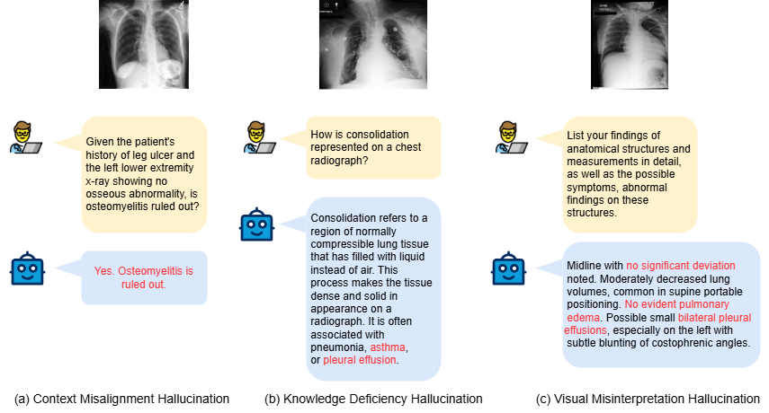
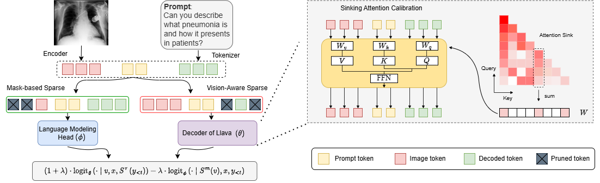

# MedVCD
=======

<p align="center" width="100%">
<a target="_blank"></a>
</p>
<p align="center" width="100%">
<a target="_blank"></a>
</p>


## Installation

To install, run the following commands to install the required packages:

```
conda env create -f environment.yml
conda activate medvcd
```

We employ [Grounding DINO](https://github.com/IDEA-Research/GroundingDINO) as the external detector to ground hallucinatory objects. To install GroundingDINO with CUDA, we simplify the installation process, where you can:

```
export CUDA_HOME=$CONDA_PREFIX
# install GroundingDINO
cd decoder_zoo/GroundingDINO
pip install -e .
```

To download pre-trained model weights for DINO:

```
# default directory that contains the weights
mkdir model_checkpoints
cd model_checkpoints
# download weights
wget -q https://github.com/IDEA-Research/GroundingDINO/releases/download/v0.1.0-alpha/groundingdino_swint_ogc.pth
```

## LVLM Backbones

The following evaluation requires for MedHEval dataset. Please download [here](https://github.com/Aofei-Chang/MedHEval) and extract it in your data path.

### Required Models and Weights

#### Base Models
- [LLaVA-1.5 7B](https://huggingface.co/liuhaotian/llava-v1.5-7b) → `eval_configs/llava-1.5_eval.yaml` [L14]
- [LLaMA-2 7B](https://huggingface.co/meta-llama/Llama-2-7b-chat-hf) → `minigpt4/configs/models/minigpt4_llama2.yaml` [L15]
- [Vicuna 7B v1.1](https://github.com/lm-sys/FastChat) → `minigpt4/configs/models/blip2_instruct_vicuna7b.yaml` [L25]
- [Vicuna 7B v0](https://huggingface.co/Vision-CAIR/vicuna-7b) → `minigpt4/configs/models/minigpt4_vicuna0.yaml` [L18]

#### Pretrained Weights
- [MiniGPT-4](https://drive.google.com/file/d/1RY9jV0dyqLX-o38LrumkKRh6Jtaop58R/view?usp=sharing) → `eval_configs/minigpt4_eval.yaml` [L8]
- [MiniGPT-4 LLaMA-2](https://drive.google.com/file/d/1RY9jV0dyqLX-o38LrumkKRh6Jtaop58R/view?usp=sharing) → `eval_configs/minigpt4_llama2_eval.yaml` [L8]
- [mPLUG-Owl2](https://huggingface.co/MAGAer13/mplug-owl2-llama2-7b) → `eval_configs/mplug-owl2_eval.yaml` [L14]


### General Arguments

- `--model`: MLLM model type [instructblip, minigpt4, llava-1.5] (default: None)
- `--data-path`: Dataset path (e.g., `COCO_2014/val2014/`)
- `--pope-type`: POPE evaluation type [random, popular, adversarial]
- `--beam`: Beam size for global search (default: 1)


### Examples of Configuration Arguments

We present some examples of configuration parameters for max generated tokens = 64:

#### Arguments for MedVCD
- `--mask_rate`: Visual token masking ratio (default: 0.5)
- `--contrastive_rate`: Contrastive learning rate (default: 0.1)
- `--sparse_kv_cache_rate`: Sparsity ratio for KV cache (default: 0.9)
- `--max_sentence_lenght`: Maximum length of generated sentence (default: 32)

#### Arguments for HALC
- `--k-candidate-num`: Number of generative focal fields for local search (default: 4)
- `--expand-ratio`: Growing factor of focal fields (default: 0.6)
- `--detector`: Detector type [dino, owlv2] (default: dino)
- `--box_threshold`: Threshold for bounding box in GroundingDino (default: 0.4)

#### Arguments for OPERA
- `--scale_factor`: Scale factor for self-attention weights (default: 50)
- `--threshold`: Threshold for attending retrospection (default: 15)
- `--num_attn_candidates`: Number of candidates per beam (default: 5)
- `--penalty_weights`: Weight of penalty term in decoding (default: 1)

#### Arguments for VCD
- `--cd-alpha`: Amplification factor (default: 1)
- `--cd-beta`: Truncation factor for adaptive plausibility constraint (default: 0.1)
- `--noise-step`: Number of steps to add diffusion noise (default: 500)


---


## How to run

#### Running CHAIR evaluation

Following [Evaluating Object Hallucination in Large Vision-Language Models](https://arxiv.org/pdf/2305.10355.pdf) and HALC, we used "Please describe this image in detail." as the prompt to query LVLM for captions of the `500` images randomly sampled from [COCO 2014 Val](https://cocodataset.org/#download) datast. Under root directory, run

```shell
python3 run_scripts/caption_generation_patch_medvcd.py \
    --model llava-1.5 \
    --data_path path/to/val2014/ \
    -d medvcd_contrastive \
    --max_new_tokens 64 \
    --num_samples 500 \
    --seed 1 \
    --gpu-id 0 \
    --output_dir path/to/output/ \
    --debugging 1

```


MiniGPT-4 and mPLUG-Owl2 can be executed using the following commands:
```shell
python3 run_scripts/caption_generation_patch_medvcd_minigpt4.py \
    --model minigpt4 \
    --data_path path/to/val2014/ \
    -d medvcd_contrastive \
    --max_new_tokens 64 \
    --num_samples 500 \
    --seed 1 \
    --gpu-id 0 \
    --output_dir path/to/output/ \
    --debugging 1

python3 run_scripts/caption_generation_patch_medvcd_mplugowl2.py \
    --model mplug-owl2 \
    --data_path path/to/val2014/ \
    -d medvcd_contrastive \
    --max_new_tokens 64 \
    --num_samples 500 \
    --seed 1 \
    --gpu-id 0 \
    --output_dir path/to/output/ \
    --debugging 1

```


> Additionally, our codebase supports various other methods, including DoLa, VCD, Opera, HALC, and more.

#### Running POPE evaluation

To collect samples for the conventional POPE evaluation, under root directory, run

```shell
python run_scripts/pope_eval.py \
    --model [LVLM Backbone] \
    --data_path [COCO_DIR] \
    -d [Decoding Strategy] \
    --pope_type [random/popular/adversarial] \
    --num_images 100 \
    --seed [SEED] \
    --gpu_id [GPU_IDs] \
    --output_dir path/to/output/
```

#### Running MME Benchmark

MME also follows the same procedure as CHAIR and OPOPE to collect samples. Alternatively, under root directory, run

```shell
python run_scripts/mme_eval.py \
    --model [LVLM Backbone] \
    --data_path [MME_DIR] \
    -d [Decoding Strategy] \
    --num_samples 30 \
    --seed [SEED] \
    --gpu-id [GPU_IDs] \
    --output_dir path/to/output/
```


#### Running post-hoc methods

Under root directory, run

```shell
python run_scripts/reviser_eval.py \
    -r [woodpecker/lure] \
    --data_path [COCO_DIR] \
    --c [PATH_TO_CAPTION] \
    --seed [SEED] \
    --gpu-id [GPU_IDs] \
    --output_dir path/to/output/
```

---


## Evaluation

#### CHAIR Scores

After preparing your caption files using the above commands, you can either choose to evaluate the captions in an **one-shot mode** (single caption) or **batch mode** (all the caption files in a folder). To evaluate a single caption file,

```shell
python eval/eval_hallucination.py --metric chair --chair_input_path [PATH_TO_CAPTION_DIR] -v
```

To evaluate a batch of caption files, run

```shell
python eval/caption_to_chair.py -c [PATH_TO_CAPTION_FOLDER_DIR]
```

to convert the caption files to the format ready for CHAIR evaluation in the same directory first. Then a `_chair.json` file will be produced under this folder. To further evaluate the CHAIR score as well as the generation quality scores, run
```shell
python eval/batch_eval.py -c [PATH_TO_CAPTION_FOLDER_DIR] --evaluator chair --coco_path [COCO_DIR]
```

Note that `[COCO_DIR]` is expected to contain both images and annotation files within the `annotations` subfolder. In other words, `[COCO_DIR]` should the the following structure:

```shell
COCO_DIR (val2014 for example)
  - annotations
    - captions_val2014.json
    - captions_val2014.json
    - instances_train2014.json
    - instances_val2014.json
    - person_keypoints_train2014.json
    - person_keypoints_val2014.json
  - COCO_val2014_000000000042.jpg
  - COCO_val2014_000000000073.jpg
  ...
```

#### POPE Scores

Similarly, you can also evaluate POPE in both modes. To evaluate a single caption file,
```shell
python eval_hallucination.py --metric pope --pope_answer_path [PATH_TO_CAPTION_DIR] --pope_question_path [PATH_TO_POPE_QUESTION] -v
```

To evaluate a batch of caption files, run
```shell
python eval/batch_eval.py -c [PATH_TO_CAPTION_FOLDER_DIR] --evaluator pope --pope_type [random/popular/adversarial]
```

The evaluation results will be saved in the same directory.


#### MME Scores


To evaluate the MME scores on each chosen subset, modify the `subset_dir` variable to include the list of directories of your target directories and run
```shell
python eval/MME_eval.py
```

#### GPT-4 assisted evaluation
SHR (Sentence-level Hallucination Ratio) is a fine-grained, diverse, and accurate evaluation benchmark of LVLM hallcuination on dense image descipription.
Please refer to the [SHR evaluation](https://github.com/opendatalab/HA-DPO/tree/main/ha_dpo/shr_eval) protocol for assessment.

#### Acknowledgments

This codebase is built upon the following repository: [HALC](https://github.com/BillChan226/HALC), [OPERA](https://github.com/shikiw/OPERA), [VCD](https://github.com/DAMO-NLP-SG/VCD), [SID](https://github.com/huofushuo/SID), [FastV](https://github.com/pkunlp-icler/FastV), [SparseVLM](https://github.com/Gumpest/SparseVLMs), [HA-DPO](https://github.com/opendatalab/HA-DPO), [MME](https://github.com/BradyFU/Awesome-Multimodal-Large-Language-Models), [Grounding DINO](https://github.com/IDEA-Research/GroundingDINO), [LLaVA](https://github.com/haotian-liu/LLaVA), etc.

We thank all the authors for their valuable contributions.

